# Polyomino Image Tiling

How faithfully can an image be reconstructed using only a fixed palette and a set of interlocking shapes? This project explores that question by formulating polyomino image tiling as a constrained optimization problem with tiles of various shapes, sizes and rotations.

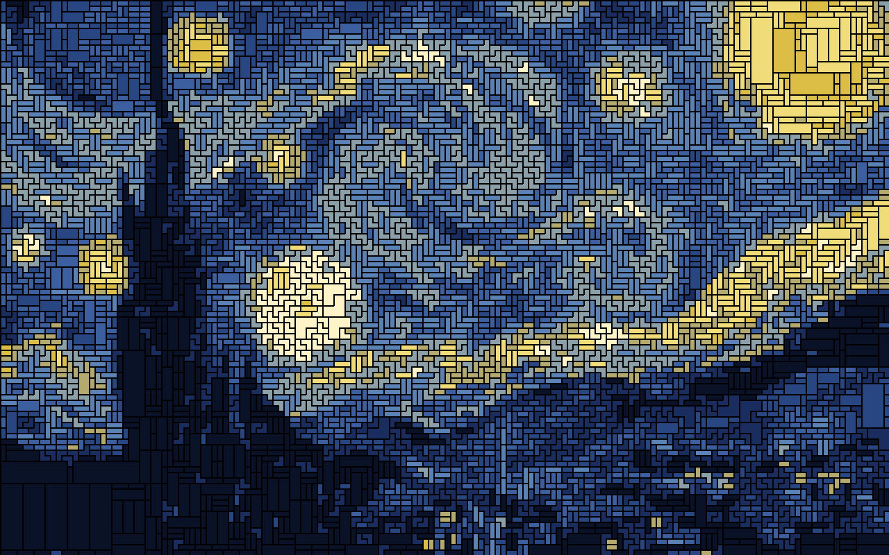

While a simple block averaging approach can approximate this greedily, it fails to find the global optimum when tiles of different shapes and sizes are introduced. We formulate the problem instead as an integer linear program and implement customized presolve optimizations. Furthermore, if the model only considers colour differences, the optimizer would default to using the smallest tiles everywhere — since smaller tiles can always fit more precisely. We introduce an edge-aware penalty and size bonus to encourage larger tiles in smooth regions and finer tiles near edges.

## Gallery
The hyperparameters $\lambda_e, \lambda_s$ control the edge penalty and size bonus terms respectively. Higher $\lambda_e$ penalizes large tiles near fine details, while higher $\lambda_s$ encourages larger tiles.

<table>
  <tr>
    <td>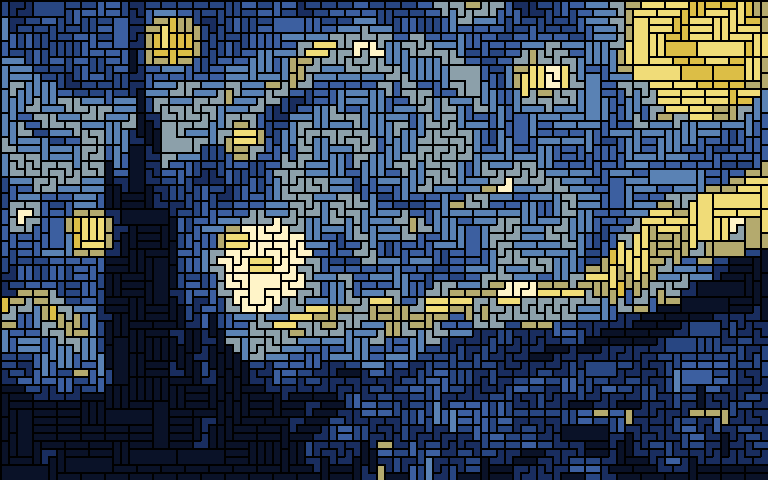</td>
    <td>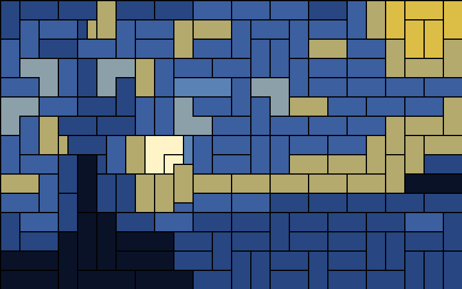</td>
  </tr>
  <tr>
    <td align="center">$\lambda_e=0, \lambda_s=0$</td>
    <td align="center">$\lambda_e=0, \lambda_s=1$</td>
  </tr>
  <tr>
    <td>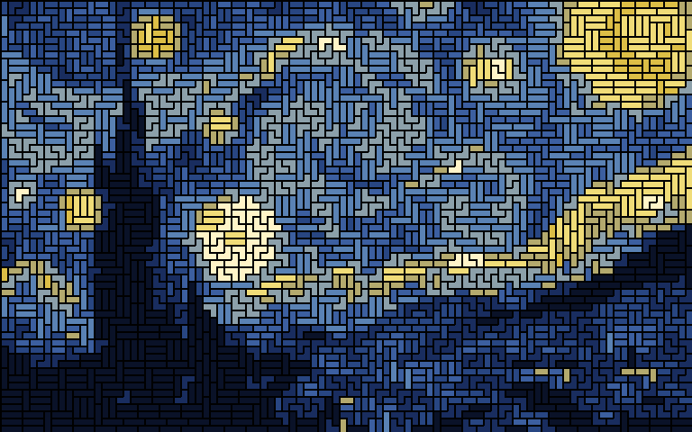</td>
    <td>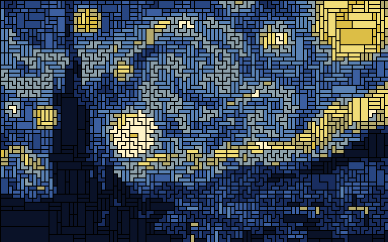</td>
  </tr>
  <tr>
    <td align="center">$\lambda_e=1, \lambda_s=0$</td>
    <td align="center">$\lambda_e=0.35, \lambda_s=0.15$</td>
  </tr>
  <tr>
    <td>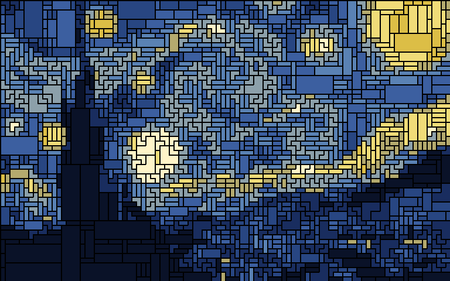</td>
    <td>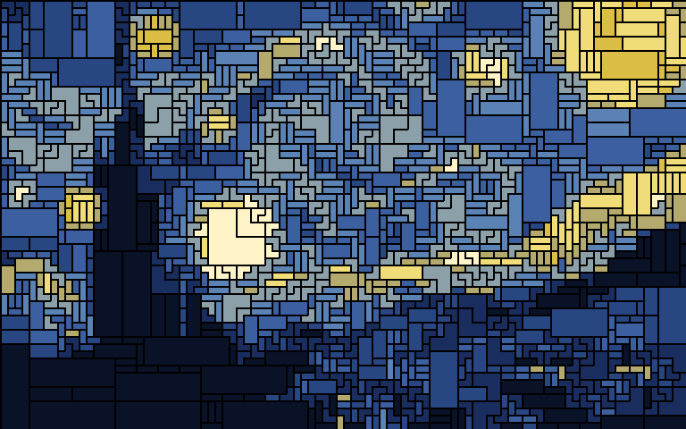</td>
  </tr>
  <tr>
    <td align="center">$\lambda_e=0.35, \lambda_s=0.2$</td>
    <td align="center">$\lambda_e=0.35, \lambda_s=0.25$</td>
  </tr>
</table>

## Image Preprocessing
To model this as a linear program, the source image is divided into $R$ rows and $C$ columns of uniform square blocks. Each block is assigned a colour based on the average RGB values of pixels in that area of the source image. Denote the RGB vector at block coordinate $(i, j)$ as $B_{ij}$. Let $[R], [C]$ be the sets of row and column indices respectively.

<table>
  <tr>
    <td>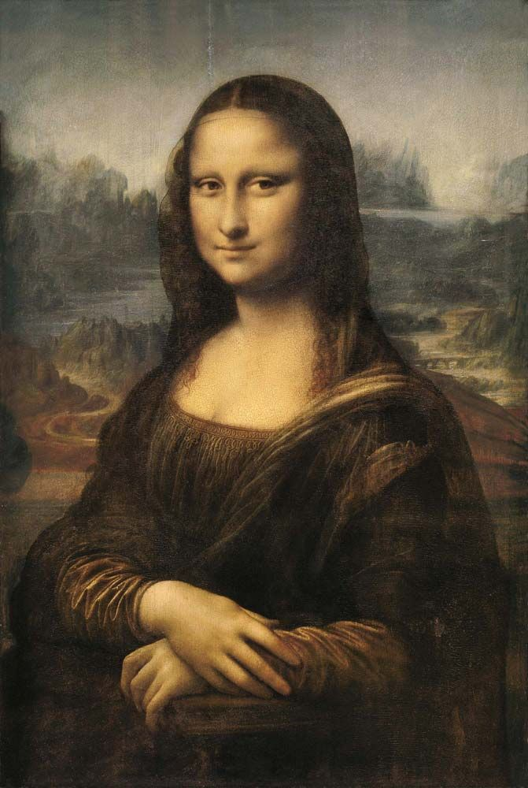</td>
    <td align="center">→</td>
    <td>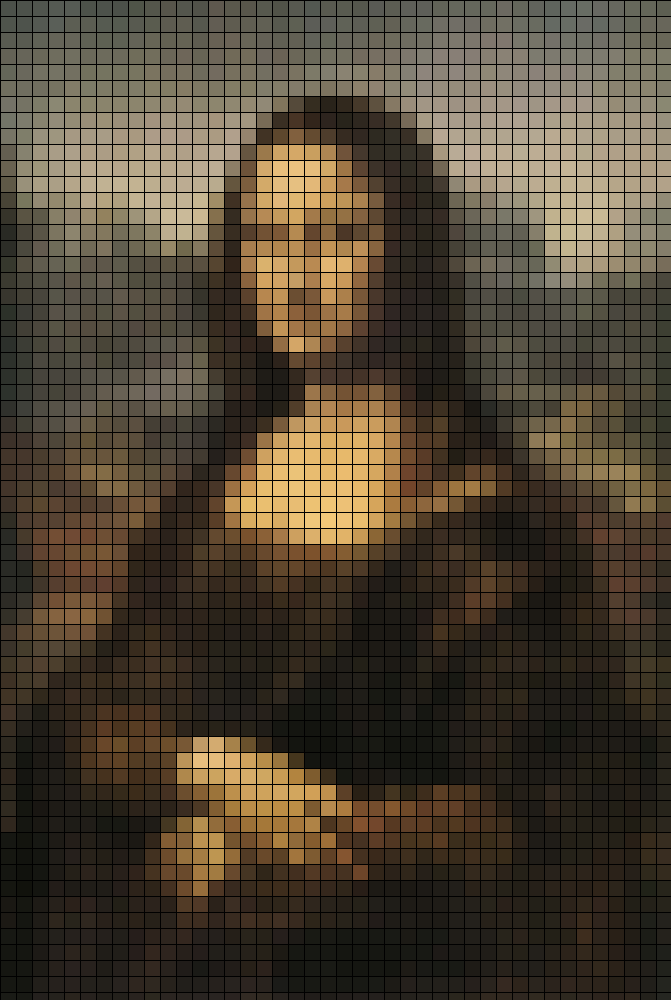</td>
  </tr>
</table>

Additionally, the image is converted to greyscale and a discrete Laplacian filter is applied to detect edges and their intensities. Denote the scalar Laplacian at block coordinate $(i, j)$ as $E_{ij}$.

<table>
  <tr>
    <td>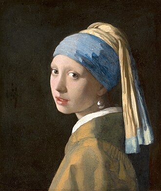</td>
    <td align="center">→</td>
    <td>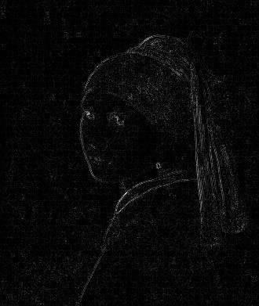</td>
  </tr>
</table>

## Polyominoes
A set of base shapes are given as input to the model.

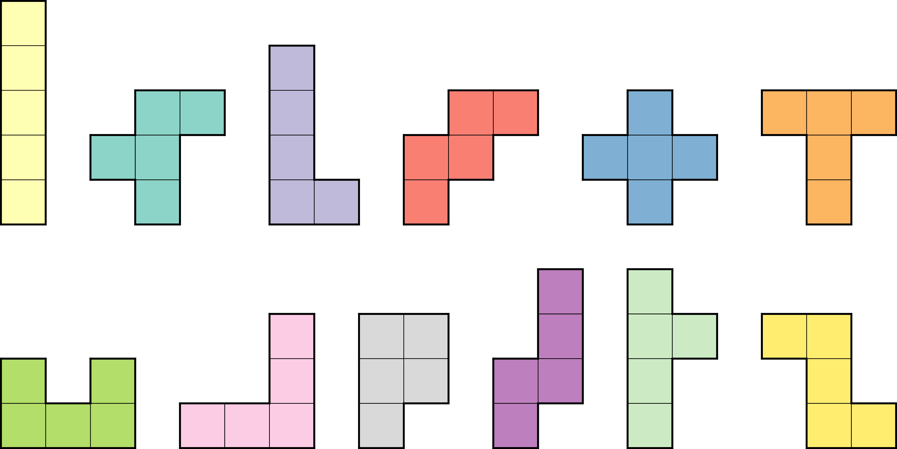
<p align="center"><em>A sample of various pentomino shapes</em></p>

From this, the model assigns palette colours to shapes. So, each colour is only available in one particular shape. The model then enumerates all feasible placements of each shape subject to rotation and scaling. A given placement $p$ corresponds to a tile of a specified colour $c_p$ and scale factor $s_p$ placed at an anchor point $(i, j)$. Let $P$ be the set of all feasible tile placements.

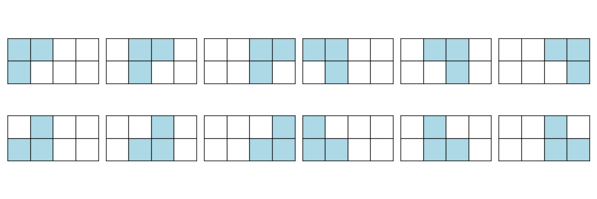
<p align="center"><em>All feasible placements of an L-tromino on a 2×4 board</em></p>

## Formulation as ILP
The cost associated with each placement can be written in 3 components:

```math
C_p = \mathrm{RGBError}_p + \lambda_e\cdot\mathrm{EdgePenalty}_p + \lambda_s\cdot\mathrm{SizeBonus}_p
```

where $\lambda_e, \lambda_s$ are hyperparameters controlling the weights of the size bonus and edge penalty terms.

Our objective function can be written:

```math
\min\sum_{p\in P}C_px_p
```

where each $x_p$ is a binary variable indicating whether placement $p$ is chosen in the final tiling. Note that the components of $C_p$ are set up before passing to solver, so that this formulation is an ILP.

### RGBError
The $\mathrm{RGBError}$ component for a placement is simply the squared $L_2$ distance in RGB space between each block in the tile's anchored footprint and the tile colour $c_p$. If $F_p$ is the block footprint of placement $p$,

```math
\mathrm{RGBError}_p = \sum_{(i, j)\in F_p} \lVert c_p - B_{ij}\rVert_2^2
```

### EdgePenalty
The $\mathrm{EdgePenalty}$ component is the maximum edge intensity of any block in the tile placement's footprint, weighted by scale factor of the tile squared. So, if the placement overlaps any edge intense region, the penalty is applied. This encourages usage of smaller blocks in detailed regions.

```math
\mathrm{EdgePenalty}_p = \left(\max_{(i, j)\in F_p} E_{ij}\right) \cdot (s_p-1)^2
```

### SizeBonus
The $\mathrm{SizeBonus}$ component subtracts from the cost of the placement based on the square of its scale factor.

```math
\mathrm{SizeBonus}_p = -(s_p-1)^2
```

### Exact Cover Constraints
Finally, constraints are added to ensure that all the blocks in the image are covered with no overlaps. Let $A_{ij}$ be the set of all placements whose footprints contain block $(i, j)$.

```math
\sum_{p\in A_{ij}}x_{p} = 1, \qquad \forall (i, j)\in [R]\times [C]
```